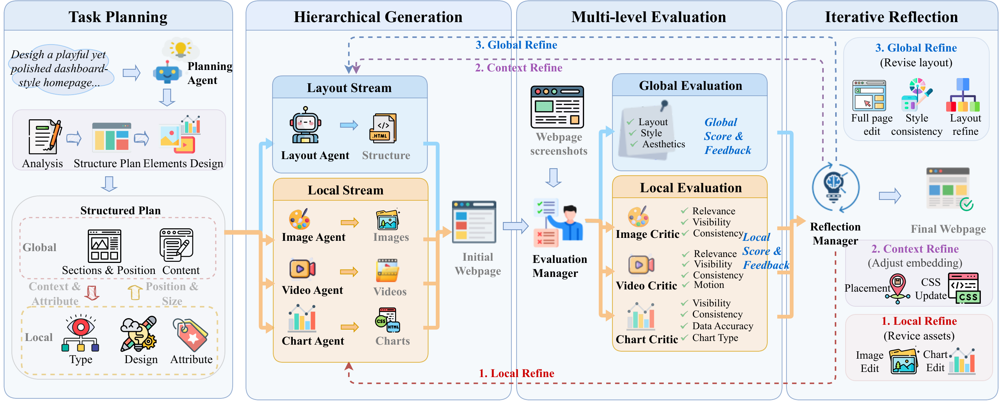

# MM-WebAgent: A Hierarchical Multimodal Web Agent for Webpage Generation

<p align="center">
  <a href="https://arxiv.org/abs/2604.15309"></a>
  <a href="LICENSE"></a>
  
</p>

## Introduction

**MM-WebAgent** is a hierarchical agentic framework for multimodal webpage generation. It coordinates AIGC-based element generation through hierarchical planning and iterative self-reflection, producing coherent and visually consistent webpages. The project also includes **MM-WebGEN-Bench**, a multi-level evaluation benchmark.

<p align="center">
  
</p>

## Installation

### 1. Create Conda Environment

```bash
conda create -n webgen python=3.12 -y
conda activate webgen
pip install -r requirements.txt
```

### 2. Install Playwright Browser

```bash
python -m playwright install chromium
```

### 3. Install Node.js (for Generation Pipeline)

Generation pipeline uses `npx http-server` to serve local files for screenshots. Install Node.js if not available:

```bash
# macOS (Homebrew)
brew install node

# Ubuntu / Debian
sudo apt install nodejs npm

# Or use conda
conda install -c conda-forge nodejs
```

Verify installation:

```bash
node --version
npx --version
```

### 4. Network Access

Charts are rendered via ECharts and load the runtime from CDN (`jsdelivr`). Chart rendering and evaluation require network access.

---

## Configuration

Set the following environment variables:

```bash
# Required
export OPENAI_API_KEY="<your-openai-api-key>"

# Optional: override base URL and model names
export OPENAI_BASE_URL="https://api.openai.com/v1"
export OPENAI_MODEL_GPT52="gpt-5.2"
export OPENAI_MODEL_GPT51="gpt-5.1"
export OPENAI_MODEL_GPT41="gpt-4.1"
export OPENAI_MODEL_GPT4O="gpt-4o"
export OPENAI_IMAGE_MODEL="gpt-image-1"
export OPENAI_IMAGE_EDIT_MODEL="gpt-image-1"

# Optional: video generation (requires --enable-video flag)
export OPENAI_VIDEO_API_KEY="$OPENAI_API_KEY"
export OPENAI_VIDEO_BASE_URL="https://api.openai.com/v1"
export OPENAI_VIDEO_MODEL="sora-2"
```

---

## Usage

### Generation

```bash
python workflow/run_generation.py \
  --data-path datasets/evaluation_dataset.jsonl \
  --limit 1 \
  --planner-model gpt-5.2 \
  --save-dir outputs/mm_webagent/gpt-5.2
```

Key options:

| Flag | Default | Description |
|------|---------|-------------|
| `--data-path` | `datasets/evaluation_dataset.jsonl` | Input JSONL dataset |
| `--save-dir` | `outputs/workflow_v3` | Output directory |
| `--planner-model` | `gpt-5.2` | Model for planning |
| `--limit` | all | Number of samples to generate |
| `--start_idx` | `0` | Start index |
| `--enable-video` | off | Enable video generation (mp4) |
| `--planner-workers` | `8` | Parallel planner calls |

Output structure (`outputs/<exp_name>/<model_name>/<case_id>/`):

```
├── main.html              # Assembled webpage
├── planner_output.json    # Structured plan
├── run_summary.json       # Generation log
├── *.png / *.mp4          # Generated images/videos
└── *.html                 # Chart subpages
```

### Evaluation & Reflection

```bash
python benchmark/run_benchmark_eval.py \
  --exp_dir outputs/mm_webagent
```

Behavior is configurable via `benchmark/configs/experiment.yaml`. Defaults:

- Multi-level evaluation (global, image, video, chart)
- Chart reflection — 3 rounds
- Image reflection — 3 rounds
- Global reflection — 3 rounds
- Outputs `eval_result_final.json` / `eval_best.json`

---

## Dataset

**MM-WebGEN-Bench** (`datasets/evaluation_dataset.jsonl`) — 120 curated webpage design prompts covering 11 scene categories, 11 visual styles, and diverse multimodal compositions (4 video types, 8 image types, 17 chart types).

JSONL format:

```json
{"file_id": "001", "input": "Create a modern landing page for a robotics startup..."}
```

---

## Citation

If you find this work useful, please cite:

```bibtex

```

---

## License

This project is licensed under the [MIT License](LICENSE).
